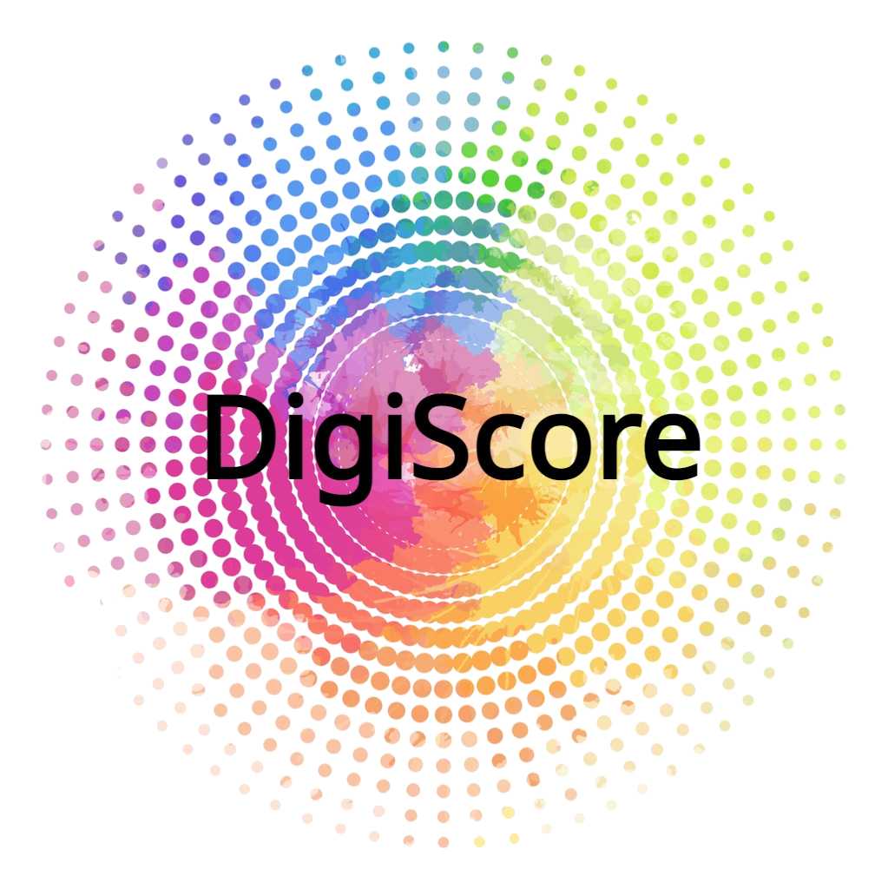

# Jess +

[](https://digiscore.github.io/)

Musicking robot interacting in real-time with a musician ensemble through drawing digital score, designed to enhance creativity using audio captured by a microphone and physiological measures ([EEG](https://en.wikipedia.org/wiki/Electroencephalography) and [EDA](https://en.wikipedia.org/wiki/Electrodermal_activity)). Currently supports [Dobot Magician Lite](https://www.dobot-robots.com/products/education/magician-lite.html) and [UFactory xArm](https://www.ufactory.cc/xarm-collaborative-robot), uses a [BrainBit](https://brainbit.com/) EEG and [BITalino](https://www.pluxbiosignals.com/collections/bitalino) EDA. Tested on Windows 10 primarily.


## Setup
- Install [Python 3.10](https://www.python.org/) or higher
- Install the requirements:
```bash
pip install -r requirements.txt
```


## Quick Start
Run `main.py`.

### About main.py
The main script to start the robot arm drawing digital score work.
Digibot calls the local interpreter for project specific functions.
This communicates directly to the pydobot library.
Nebula kick starts the AI Factory for generating NNet data and affect flows.
This script also controls the live mic audio analyser.

Args:
- `duration_of_piece`: the duration in seconds of the drawing      
- `continuous_line` (bool): True = will not jump between points
- `speed` (int): the dynamic tempo of the all processes. `1` = slow, `5` = fast
- `dobot1_port`: port for the Dobot, may need to be changed depending on the machine


## Contributing as co-developers

- Clone this repository using [git](https://git-scm.com/)
- Create a branch and work on a task (one at a time)
- Once tested, create a pull request from that branch that will be reviewed and eventually merged

*Note: pull regularly!!*
